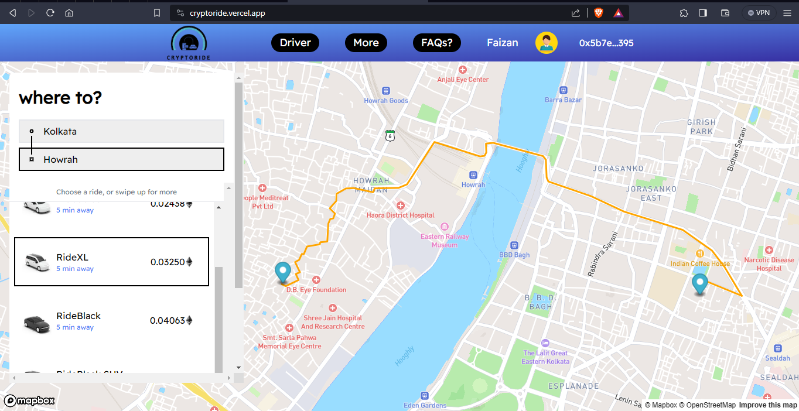

# CryptoRide
This is a decentralized cab-booking made using Next.js, TailwindCSS for styling, Node.js server and Sanity DB.

Mapbox is used for Navigation and Metamask for Payments.



## Getting started

To get started with this project, run

```bash
  git clone https://github.com/Faizan711/CryptoRide.git
```

and copy the .env.example variables into a separate .env file, fill them out & and that's all you need to get started!

Install the dependencies by running

```bash
npm install
# or
yarn install
# or
pnpm install
# or
bun install
```

Lastly, run the development server:

```bash
npm run dev
# or
yarn dev
# or
pnpm dev
# or
bun dev
```

Open [http://localhost:3000](http://localhost:3000) with your browser to see the result.

## Learn More

To learn more about Next.js, take a look at the following resources:

- [Next.js Documentation](https://nextjs.org/docs) - learn about Next.js features and API.
- [Learn Next.js](https://nextjs.org/learn) - an interactive Next.js tutorial.
